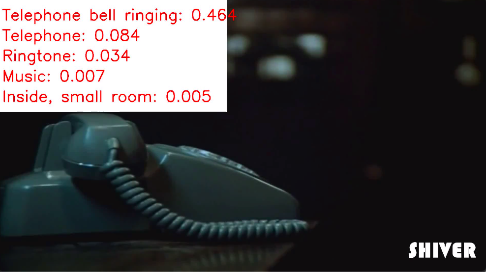

# Sound event detection using Pretrained Audio Neural Networks (PANNs)

This codebase provides code for building a sound event detection (SED) demo. The SED systems used in this codebase are directly from large-scale audio tagging systems trained on AudioSet: https://github.com/qiuqiangkong/audioset_tagging_cnn. If this codebase is helpful, please cite [1].

## Demo
https://www.youtube.com/watch?v=SQYyfYCcvtw

## How to use:

```
git clone https://github.com/qiuqiangkong/audioset_tagging_cnn
wget -O "Cnn14_DecisionLevelMax_mAP=0.385.pth" "https://zenodo.org/record/3576403/files/Cnn14_DecisionLevelMax_mAP=0.385.pth?download=1"

pip install -r requirements.txt

MODEL_TYPE="Cnn14_DecisionLevelMax"
CHECKPOINT_PATH="Cnn14_DecisionLevelMax_mAP=0.385.pth"

CUDA_VISIBLE_DEVICES=0 python3 sound_event_detection.py --model_type=$MODEL_TYPE --checkpoint_path=$CHECKPOINT_PATH --audio_path="examples/R9_ZSCveAHg_7s.wav" --video_path="examples/R9_ZSCveAHg_7s.mp4" --out_video_path="results/silent_with_text_R9_ZSCveAHg_7s.mp4" --cuda
```

## Results
The output video looks like:



## Cite
[1] Qiuqiang Kong, Yin Cao, Turab Iqbal, Yuxuan Wang, Wenwu Wang, Mark D. Plumbley. "PANNs: Large-Scale Pretrained Audio Neural Networks for Audio Pattern Recognition." arXiv preprint arXiv:1912.10211 (2019).